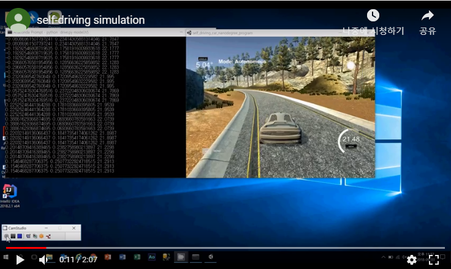

|Demo 직캠|
|:--------:|
|[](https://youtu.be/i0tPGenk2o0)|
|[YouTube Link](https://youtu.be/i0tPGenk2o0)|

## Project Description

유니티 시뮬레이터를 이용하여 자율주행 머신러닝 모델을 테스트한 직캠입니다.
CNN 알고리즘 기반의 KERAS 모델을 사용합니다.


## Quick Start

아래의 간결한 순서를 통해서 직접 데모 모델을 실행해 보실 수 있습니다. 

- 먼저, 최신 [miniconda](https://conda.io/miniconda.html) 를 다운로드 받고 설치합니다.
- 소스 코드를 다운받아 압축파일을 해제합니다. 
- UNITY 시뮬레이션 파일을 [Linux](https://d17h27t6h515a5.cloudfront.net/topher/2017/February/58983558_beta-simulator-linux/beta-simulator-linux.zip) [Mac](https://d17h27t6h515a5.cloudfront.net/topher/2017/February/58983385_beta-simulator-mac/beta-simulator-mac.zip) [Windows](https://d17h27t6h515a5.cloudfront.net/topher/2017/February/58983318_beta-simulator-windows/beta-simulator-windows.zip) 환경에 따라 다운로드받고 설치합니다.
- Anaconda prompt를 실행하고 아래와 같이 파이썬 환경을 준비합니다.
- 소스코드 폴더로 경로를 이동합니다. 
```python
 > cd selfDrivingDemo
```
- 파이썬 환경을 생성하고 필요한 파이썬 패키지를 자동으로 다운로드 받습니다.
```python
 > conda env create -f environment.yml  
```
- selfDrivingDemo 환경을 활성화합니다.
```python 
 > activate selfDrivingDemo  
```
- 이제 시뮬레이션 프로그램을 실행하고 AUTONOMOUS MODE를 선택합니다.
- 마지막으로, 자율주행을 시작합니다.
  케라스모델이 포함된 파이썬프로그램을 실행합니다. 
```python
  > python drive.py model.h5
```

### Files included

- model.py The script used to create and train the model.
- drive.py The script to drive the car. 
- utils.py The script to provide useful functionalities (i.e. image preprocessing and augumentation)
- model.h5 The model weights.
- environments.yml conda environment (Use TensorFlow without GPU)
- environments-gpu.yml conda environment (Use TensorFlow with GPU)

## References
	- NVIDIA model: https://devblogs.nvidia.com/parallelforall/deep-learning-self-driving-cars/
	- Udacity Self-Driving Car Simulator: https://github.com/udacity/self-driving-car-sim
